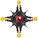

---
title: "Vancleef: Game Design Document"
revision: "Revisión 0.3"
author: 
  - "Andres Revolledo Galvez"
  - "Rodrigo Linares"
  - "Alvaro Barua"
institution: "Universidad Peruana de Ciencias Aplicadas"
documentclass: article
papersize: a4
fontsize: 12pt
date: \today
classoption:
  - titlepage
header-includes:
  - \usepackage{float}
  - \usepackage[spanish]{babel}
numbersections: true
toc: true
lof: true
lot: true
graphics: true
...

# Visión del proyecto

## Sinopsis del juego
Las autoridades del imperio galáctico de Trantor están tras de ti, por un crimen que no cometiste. Escoge entre VanCleef o Reol y usa sus diferentes naves y habilidades para poder derrotar a tus enemigos.

##Genero
Shoot 'em up, Bullet hell y Rougelite, Top down shooter.

##Audiencia
Jugadores de 15 a 23 años de edad que les guste los juegos de disparos, con estética retro y pixel art.

##Plataformas
El juego debera correr en los sistemas operativos Windows, Mac OSX y Linux. Ademas sera disponible en plataformas moviles como Android y iOS. Finalmente debera correr en dispositivos SmartTV.

## Influencias
El juego toma influencia de otros Bullet hells como Touhou, Shoot em ups clásicos como Tyrian, Gradius y toma elementos de juegos rougelite como Risk of Rain y Binding of Issac.

## Descripción del juego
El juego es un _shoot 'em up_ retro con estética pixel art, el cual permitirá al jugador tener un solo intento de llegar al final, derrotando olas de enemigos cada vez mas difíciles hasta derrotar al jefe final. Si el jugador falla tendrá que volver a comenzar de cero, re compensándolo con un mejor puntaje cada vez.

# Jugabilidad
Esta sección explica la experiencia que el usuario tendrá al jugar y controlar a su personaje, que sentimientos se tratan de evocar en el jugador y explica las mecánicas que cada personaje presenta.

## Satisfacción
El reto principal del juego es lograr llegar al final del nivel y derrotar al jefe final. Para ello el jugador tendrá que sobrevivir varias olas de enemigos y las balas que disparan, las cuales podrán llenar gran parte de la pantalla, y proveerse de diferentes _powerups_ que mejoraran las capacidades ofensivas y defensivas del personaje jugable.

## Aprendizaje
El juego contara con pocos controles para su fácil aprendizaje. Estos serán de movimiento, poder moverse por toda la pantalla, poder disparar tanto su arma principal como la secundaria y poder moverse mas lento para tener un control mas fino para esquivar todos los obstáculos que se le opongan.

## Controles

El juego se podrá controlar con el teclado en el caso de Windows, MacOSX y Linux, y con un dispositivo móvil en el caso de SmartTVs y Android. Acá se muestran las configuraciones a utilizar en cada esquema:

###Teclado

<!--
\begin{figure}[H]
\includegraphics{diagrams/keyboard_layout.eps}
\caption{Layout Teclado}
\end{figure}
-->

En azul se resalta la configuración principal, mientras que en rojo los controles secundarios, para los usuarios que sean zurdos o prefieran esa configuración, ambos controles funcionaran a la vez ya que no se interponen.

W y Arriba:
: Incrementa la posición del jugador en Y

A y Izquierda:
: Decrementa la posición del jugador en X

S y Abajo:
: Decrementa la posición del jugador en Y

D y Derecha:
: Incrementa la posición del jugador en X

Z y M:
: Permite disparar la arma primaria

X y N:
: Permite hacer uso de la bomba, arma secundaria.

Shift Izquierdo y Derecho:
: Reduce la velocidad de movimiento del jugador mientras se mantenga apretado

###Móvil

<!--
\begin{figure}[H]
\includegraphics{diagrams/mobile_layout.eps}
\caption{Layout Móvil}
\end{figure}
-->

Análogo:
: Moverá al jugador en la dirección unitaria que se refleja, las lineas punteadas reflejan un umbral que al pasarlo el jugador tendrá la velocidad normal, todo dentro es el movimiento lento, este umbral tendra un radio de 0.6.

Botón 1:
: Permite disparar el arma primaria

Botón 2:
: Permite disparar la bombas, arma secundaria

## Movimiento

Al moverse no contara con simulación de física, el movimiento sera 1:1, no habrá aceleración ni inercia. Una vez se deje de apretar los controles el personaje se detendrá y reproducirá la animación de _Idle_. Cuando se encuentre en movimiento se representara con una animación que muestre los motores de la nave funcionando y cuando vaya a la izquierda o derecha la nave deberá reflejarlo visualmente.

El movimiento del jugador dependerá de la velocidad base del personaje y un multiplicador determinado por el estado actual, disparando,  lento y combinación. A continuación es una tabla de como cada estado modifica la velocidad.

| Estado             | Multiplicador |
|--------------------|--------------:|
| Normal             | 1x            |
| Lento              | 0.4x          |
| Disparando         | 0.8x          |
| Lento y Disparando | 0.2x          |

: Multiplicador de movimiento

Usar el ataque secundario no afecta el movimiento del jugador. En el caso del control análogo para móviles, se utiliza un umbral para determinar si esta en estado normal o lento, no se tomara los valores intermedio.

## Disparo
El jugador podrá disparar con el botón especificado previamente, para optimización y mecánica se tendrá una cola de 10 balas reutilizables al inicio del juego, de las cuales solo estarán disponibles 3 a la vez, para poder acceder al resto de balas se deberá de obtener un powerup de Incremento de balas, el cual se especifica en la sección powerups.

Esto hace que el jugador tenga que pensar cuando disparar y no mantenga siempre apretado el botón de disparo, el incremento de balas mejorara su capacidad ofensiva pero sin llegar el punto en que pueda limpiar la pantalla sin problemas. 

Todas las balas que salgan de pantalla volverán a ser puestas en cola y podrán volver a ser utilizadas.

## Personajes

A continuación se detallan cada uno de los dos personajes jugables, una pequeña biografía, las diferentes habilidades de cada uno y como se comparan entre ellos. Los niveles de velocidad y balas son mejoras que se consiguen mediante _powerups_.

Las balas de ambos personajes tendrán 3 atributos básicos, la velocidad de movimiento, el daño que hacen y su representación gráfica.

###Vancleef
Edwin VanCleef fue originalmente un piloto de carga para el imperio galáctico de Trantor luego de su reconstrucción al final de de la Segunda Guerra contra Anacreon. Luego de un conflicto con la nobleza de Trantor, que se negaba a pagar por un contrato hecho con la asociación de pilotos de carga intergaláctica, se originó una revuelta en la cual la reina Tiffin Wrynn fue asesinada. Dado que la revuelta era liderada por VanCleef se le atribuyó a el crimen a él. Ahora VanCleef debe escapar del imperio, quien lo persigue injustamente.

#### Velocidad

Tendrá la velocidad mas alta de los dos, representado visualmente por los dos motores que tiene y su basica tecnologia de disparo, la siguiente tabla están los valores de velocidad para cada nivel:

| Nivel | Velocidad |
|------:|----------:|
|     1 |        10 |
|     2 |        13 |
|     3 |        16 |

: Niveles de velocidad Vancleef

#### Patrón de balas
Vancleef tendrá láseres clásicos de color azul, estas tendrán un movimiento lineal hacia arriba y todas la balas serán paralelas, comenzara teniendo solo 1 punto de disparo pero a cada nivel incrementado aumentara, en la siguiente tabla se muestra como evoluciona, el daño que cada bala hace y la velocidad de viaje que tienen.

| Nivel | Daño | Velocidad | Patrón                                      |
|------:|-----:|----------:|:-------------------------------------------:|
| 1     | 1    | 1         |  |
| 2     | 2.2  | 1.5       |  |
| 3     | 3.6  | 2         |  |

: Patrones de Balas Vancleef

###Reol
Conocida en todo el imperio galáctico, Reol fue una joven cantante y jugadora profesional de StarCraft 2, quien en su tiempo tuvo mucho éxito, haciendo tours y participando en torneos por toda la galaxia. Todo esto de derrumbó cuando hubo un intento de asesinato contra ella en Trantor, durante un concierto, en el cual en un acto de defensa propia asesinó a su atacante. Las autoridades no consideraron que esta muerte fue resultado de defensa propia y trataron de arrestar a Reol, quien decidió escapar en una nave, la cual no le resultó dificil de manejar gracias a sus habilidades en StarCraft 2.

#### Velocidad
Sera mas lenta con respecto a Vancleef y se representara esto visualmente por un motor mas grande en la parte posterior, ya que su nave se enfoca mas en el área de disparo lo cual requiere mas energía para las armas. La siguiente tabla es el valor base de velocidad por cada nivel:

| Nivel | Velocidad |
|------:|----------:|
|     1 |         7 |
|     2 |         9 |
|     3 |        12 |

: Niveles de velocidad Reol

#### Patrones de balas
Las balas de Reol tendrán un movimiento en onda y un aspecto de láser eléctrico que se sigue un movimiento sinusoidal. La dirección de las balas irán en un arco con respecto al punto de origen, así abarcara una mayor área de ataque. A continuación se muestra como serian los patrones en cada nivel y sus atributos:

| Nivel | Daño | Velocidad |                Patrón               |
|:-----:|-----:|----------:|:-----------------------------------:|
|   1   |  0.8 |       1.2 |  |
|   2   |  1.6 |       1.8 |  |
|   3   |  2.4 |       2.5 |  |

:Patrones de Balas Reol

## Bomba
Ambos personajes contaran con un ataque secundario que es un bomba, esta bomba eliminara por completo todos los enemigos y balas que se encuentren en pantalla al momento de ser usada. Tendra un limite inicial de 1 bomba disponible máxima y este podrá ser incrementado con el powerup Incremento bombas especificado en la sección de componentes, en caso se obtenga mas bombas que el limite, esto generara 1000 puntos extra. Al iniciar el juego no se contara con ninguna bomba disponible y con un máximo posible de 1 y se tendrá que eliminar naves enemigas para obtener alguna o realizar graze, explicado mas adelante.

Al usar la bomba flotara hacia arriba y deberá de colisionar con algún enemigo o bala para poder explotar, con lo que se mostrara un efecto de destrucción que tornara la pantalla blanca por unos instantes, esto elimina a todos los enemigos de pantalla a excepción del jefe, el cual sufre un 5% de daño sobre su vida restante. En el caso que no colisione, saldrá de la pantalla y no tendrá efecto.

El HUD deberá mostrar la cantidad de bombas que se tienen, mostrando el total de bombas que se pueden tener a la vez, mostrando el _sprite_ cuando esta disponible una bomba y una silueta cuando no se tiene una bomba.
<!-- Imagen de HUD, sprite de la bomba y explosion -->

## _Graze_
_Graze_ se refiere a cuando el jugador se acerca bastante a los proyectiles enemigos pero no colisiona con estos. Esta mecánica esta ligada a las bombas, ya que recompensa al jugador incrementando el medidor de carga de bomba, cada vez que se haga graze incrementara en un punto la barra de progreso en el HUD, cuando esta se completa se otorgara al jugador con una bomba extra, si ya se ha llegado al limite de bombas hacer graze otorgara 10 puntos extra.
<!-- Imagen de HUD y como realizar graze -->

## _Hitbox_
El _hitbox_ se refiere a la área de colisión del jugador, esta sera mas pequeña que la representación gráfica de la nave, siendo de un circulo no mayor a 5 pixels, así permitiendo al jugador poder esquivar todas las balas enemigas posibles, ya que estas podrán llegar a cubrir gran cantidad de la pantalla.
<!-- Imagen del hitbox de balas sobre un personaje -->

Ademas para la recolección de los objetos como diamantes y powerups se contara con otro _hitbox_ del tamaño del _spirte_ que solo tendrá efecto con estos objetos.
<!-- Imagen del hitbox de objetos -->

# Componentes

## Enemigos
Esta sección explica cada tipo de nave enviga que se presentara al jugador así como sus distintos comportamientos y las variaciones que cada uno presenta al incrementar la dificultad del juego a medida que avanza el tiempo.

El juego cuenta con 6 tipo de enemigos básicos y cada uno de estos tiene variaciones que incrementan su dificultad. A su vez cada uno de ellos tendrá un patrón diferente de disparo y se podrán diferenciar visualmente.

Para dar un nivel de satisfacción al jugador, cada enemigo al ser destruido reproducirá una animación de destrucción y a la vez mostrar rápidamente un puntaje que el jugador obtiene por destruirlo, este numero variara según tipo de enemigo y su dificultad. Ademas cada uno tendrá una probabilidad de crear un diamante o powerup al ser destruido, en el detalle de cada uno se definirá que powerups podrán generar. El tipo de diamante generado varia solo por la dificultad de la nave enemiga, el detalle de cada diamante se vera mas adelante.

El nivel de dificultad de los enemigos es determinada por la cantidad de tiempo que se va jugando, en la sección Entorno se describe cuando se cambia de dificultad. Todo enemigo que salga de la pantalla sera destruido y no otorgara ningún puntaje.
<!--- Definir los puntajes, patrones de balas, patrones de movimiento... --->
<!--- Definir cada variacion posible (3 min excepto jefe) ... --->
<!--Images de movimineto y de disparos-->

### Viking
Los Vikings son las naves más básicas del imperio galáctico y las más abundantes debido a que su costo de producción es bajo y son aptas para la mayoría de misiones que pueden existir.

Este enemigo tendrá un patrón de movimiento simple, tendrá un movimiento parabólico, desde donde inicie ira para abajo y al llegar a la parte baja de la pantalla por 10% regresara arriba tratando de ir al centro de la pantalla. Todas las versiones de este enemigo se moverán de la misma manera.

Su patrón básico de disparo serán balas que se mueven en linea recta en una dirección, cada nivel se diferenciara visualemnte por el color de la nave las cuales tendrán un numero diferente de proyectiles y velocidad de viaje diferente. Al ser el primer enemigo su versión inicial tendrá solo 1 hit de vida y debera incrementar su defensa de tal forma que no pueda ser derrotado con un solo golpe en sus versiones posteriores. A continuación se muestran las variaciones a sus atributos como nave y de sus balas y como evoluciona en cada nivel:

| Nivel | Vida | Velocidad | Color       | Puntaje |
|:-----:|-----:|----------:|-------------|--------:|
|   1   |   1  |    1 m/s  | Rojo        |      30 |
|   2   | 2.5  |  1.5 m/s  | Azul        |      50 |
|   3   | 3.5  |  2.5 m/s  | Verde       |      70 |
|   4   |   5  |  3.7 m/s  | Rojo oscuro |     100 |

: Atributos de Viking

| Nivel | Tiempo | Velocidad |   Patron disparo                        |
|:-----:|-------:|----------:|:---------------------------------------:|
|   1   |   1.5s |    3 m/s  |  |
|   2   |   1.2s |    4 m/s  |  |
|   3   |   1.0s |    5 m/s  |  |
|   4   |   0.8s |    6 m/s  |  |

:Atributos de balas Viking

### Reaper
Los Reapers son naves kamikaze, es decir que su único objetivo es encontrar a su víctima y explotar junto a ella. Solo son pilotados por prisioneros a los cuales se les ha implantado tecnología de control mental. Son bastante lentas, pero resistentes y al mínimo contacto con su enemigo esta explotará inmediatamente por lo que el jugador tendrá que deshacerse rápido de ellas.

Es un enemigo que no podrá disparar, por ello siempre tratara de seguir al jugador y explotar con el. Para moverse buscara la posición actual del jugador y se moverá linealmente hacia el por un cierto tiempo, luego se detendrá si no llego a colisionar y buscara la nueva posición del jugador, rotara hacia esa dirección y repetirá este patrón.

A continuación la tabla de propiedades de la nave:

| Nivel | Inc. rotación | Vel. movimiento | Color | Daño | Puntaje |
|:-----:|--------------:|----------------:|-------|------|---------|
|   1   |    5 grados   |         4 u/s   | Azul  |  3   |   500   |
|   2   |   10 grados   |         6 u/s   | Verde |  5   |   750   |
|   3   |   15 grados   |         8 u/s   | Rojo  |  8   |  1000   |

: Atributos de Reaper

### Reaven
Los Ravens están equipados con cañones que apuntan en todas las direcciones, pues con ellos pueden deshacerse de cualquier enemigo que se presente a sus alrededores. Son usualmente usados en misiones de reconocimiento del imperio galáctico.

Este enemigo tendrá una forma similar a la de una estrella, tendrá 4 puntos de disparo principales en apariencia y tendrá un patrón de disparo en el cual las balas formaran un circulo que se va expandiendo, todas la balas iniciaran con una dirección y se moverán rectamente.

Se moverá de manera simple, siempre hacia abajo. No tratara de atacar activamente al jugador puesto que es una nave automática que solo se encuentra explorando pero tiene capacidades ofensivas.

No contara con mucha defensa, teniendo la menor cantidad de vida entre todos los enemigos en general, comenzando con 0.8 de vida pudiendo ser derrotado de un solo golpe por ambos personajes.

A continuación la tabla de atributos de la nave y sus balas.

| Nivel | Vida | Velocidad | Color       | Puntaje |
|:-----:|-----:|----------:|-------------|--------:|
|   1   | 0.8  |  0.8 m/s  | Gris        |      25 |
|   2   | 1.5  |  1.4 m/s  | Rojo        |      40 |
|   3   | 3.0  |  2.2 m/s  | Negro       |      60 |

: Atributos de Reaven

| Nivel | Tiempo | Velocidad |   Patron disparo                            |
|:-----:|-------:|----------:|:-------------------------------------------:|
|   1   |   2.0s |  2.5 m/s  |  |
|   2   |   1.5s |    3 m/s  |  |
|   3   |   1.0s |  4.5 m/s  |  |

:Atributos de balas de Reaven

### Phoenix
Conocidos como las naves con mayor frecuencia de disparo en el arsenal del imperio galáctico, los Phoenix lanzan varios proyectiles que forman una onda sinusoidal. Debido a esta forma sus disparos tal vez no sean los más precisos, pero compensan por la velocidad a la cual disparan.

Son naves que disparan gran cantidad de balas, su movimiento en pantalla es casi estacionario, se mantienen en una posición a una altura de 1/4 de la pantalla desde arriba y se motera oscilando de izquierda a derecha hasta ser destruido.

Sus balas tendrán una ondulación, haciendo así que sus disparos abarquen una mayor área, pero no tendrá un gran poder de ataque, tendrán una apariencia de electricidad.

Acá las propiedades de la nave en cada nivel:

| Nivel | Vel. disparo | Vel. oscilacion | Color   |
|:-----:|-------------:|----------------:|---------|
|    1  |      4 u/s   |           1 u/s | Naranja |
|    2  |      6 u/s   |           2 u/s | Rojo    |
|    3  |     10 u/s   |           3 u/s | Negro   |

: Atributos de Phoenix

Aca las propiedades de las balas del phoenix:

| Nivel | Vel. movimiento | Daño |
|:-----:|----------------:|-----:|
|   1   |           6 u/s |  0.5 |
|   2   |           8 u/s |  1.0 |
|   3   |          12 u/s |  1.5 |

### Banshee
Un nuevo prototipo de nave del imperio, los Banshees, utilizan misiles teledirigidos. Han sido convocados para la persecusión de los fugitivos de Trantor, pero al parecer sus misiles no son los mejores, pues no pueden mantener la velocidad de una navede combate. Sus misiles se dirigen a la coordenada en la cual se encontraba el jugador hace un segundo, lo que permite que, siempre y cuando el jugador se mantenga en movimiento, la supervivencia del mismo.

### Battlecruiser (Jefe)
Conocidos como Battlecruisers o Star Destroyers, estas inmensas naves solo son enviadas en situaciones desesperadas. Son extremadamente resistentes y cuentan con la frecuencia de disparo de los Phoenix. Estan equipados con tres cañon frontales que solo pueden ser usados uno a la vez y solamente cada diez segundos, pero cuando uno de ellos es disparado se genera un rayo de energía que cubre un tercio del campo de juego.

## _Powerups_
Los powerups son objetos flotantes en la pantalla que aparecen al eliminar enemigos, cada uno de ellos tendrá un efecto diferente sobre el jugador si es que se logra coger.

* Subir velocidad jugador:
: Incrementara el nivel de velocidad del personaje, de ser que se encuentre en el nivel maximo, se otorgara 300 puntos

* Subir nivel balas:
: Incrementara el nivel de balas del personaje, de ser que se encuentre en el nivel maximo, se otorgara 300 puntos

* Escudo:
: Activa un escudo, el cual estara activo por 10 segundos, todas las balas enemigas que hagan contacto con el escudo seran eliminadas.
: En caso se obtenga otro escudo este solo otorgara un puntaje extra de 2000 puntos, el tiempo previo del escudo se mantendra.

* Bomba extra:
: Agrega una bomba, si ya se tiene el máximo de bombas, este powerup otorgara 1000 puntos.

* Incremento Bombas:
: Incrementa el maximo posible de bombas, no incrementa el numero de bombas disponibles, el total maximo posible seran 3. Si ya se tiene 3, este powerup otorgara 1500 puntos.

* Incremento Balas:
: Incrementa en 1 la cantidad maxima de balas que puede usar el jugador a la vez, el total sera de 10 y cuando se obtenga desde este punto este powerup se obtendran 100 puntos.

## Diamantes
Los diamantes darán puntos extra al jugador, estos deberán ser atrapados antes de que puedan otorgar el puntaje. De ser que salgan de la pantalla, estos se perderán. Estos tendrán 4 niveles, cada nivel otorgara al jugador un puntaje diferente y serán diferenciados por su color.

A continuación una tabla de cuanto puntaje dará que diamante y el color que lo representa:

| Color  | Puntaje |
|--------|--------:|
| Rojo   |   100   |
| Azul   |   250   |
| Verde  |   400   |
| Blanco |   500   |

: Puntajes diamantes

# Entorno
Esta sección explica cada ambiente que el jugador podrá ver en el juego, las variaciones entre ellos, como su apariencia gráfica y sonora, como se generan las olas de enemigos y que patrones deberá de seguir en cada uno de ellos y el objetivo.

<!--- Que enemigos se intrucen en que momento, cuando se pasa a un siguiente entorno, --->

# Puntaje 
<!-- Como debera funcionar el sistema de Puntaje -->

# Interfases

## Flujo de Pantallas
Aca se muestra como sera el flujo de las pantallas del juego.

# Extra
El juego contara con una pantalla de créditos que podrá ser accedida mediante un boton del menu principal.

# Arte

